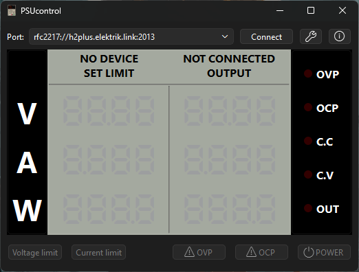

# PSUcontrol

This is an application for controlling a Velleman LABPS3005D bench PSU and any compatible ones.

It is still a work-in-progress and has only been tested with the aforementioned Velleman.

## TODO

- Fill out this README more
- Add toggleable graphing
- CLI-interface
- TUI-interface

## License

This project is licensed under the BSD 3-Clause License - see the [LICENSE](LICENSE) file for details.
